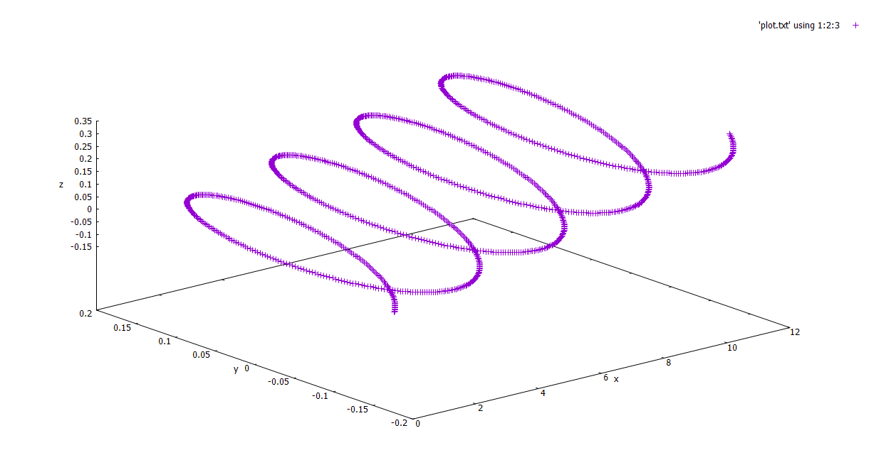

# `livecode-projectile`
---


A simple implementation of an Euler integrator for projectile motion. This program was written (mostly) live, in lecture for SOFE-2850U in Fall 2017.

Next week, we will add drag and stopping conditions. The drag will make the output more interesting. Implementing stopping conditions in a generic way force us to introduce lambdas and templates.

## Compilation

Compile with
```bash
clang++ -std=c++14 -o assignment1 assignment1.cpp
```
or
```bash
g++ -std=c++14 -o assignment1 assignment1.cpp
```
and run as
```bash
./assignment1
```
and watch your terminal fill with numbers.

## Output

The output will be six columns of numbers with the following order:
```
time [s], x-position [m], y-position [m], z-positon [m] x-speed [m/s], y-speed [m/s], z-speed [m/s]
```
Plot the, you get the familiar parabolic trajectory, which will depend on your constants:  

