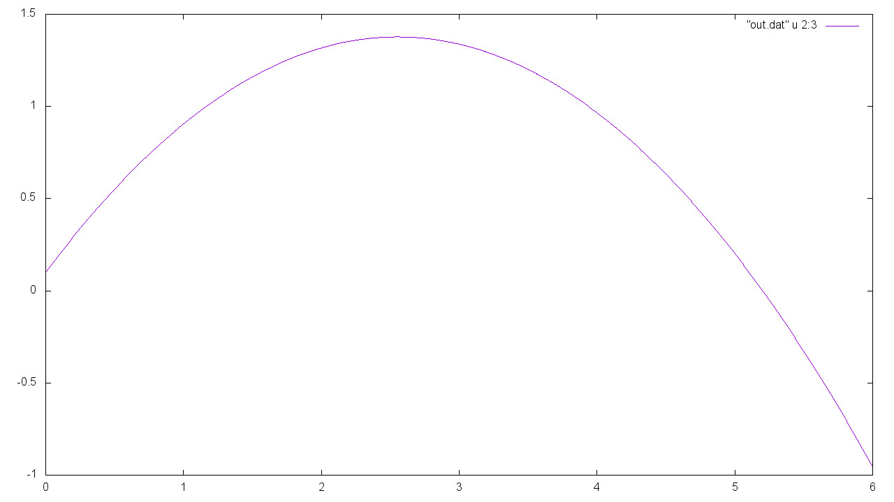

# livecode-projectile

A simple implementation of an Euler integrator for projectile motion. This program was written (mostly) live, in lecture for SOFE-2850U in Fall 2017.

Next week, we will add drag and stopping conditions. The drag will make the code more interesting, while the stopping conditions will introduce us to lambdas and templates.

## Compilation

Compile with
```bash
clang++-6.0 -std=c++17 -o projectile projectile.cpp
```
and run as
```bash
./projectile
```
and watch your terminal fill with numbers.

## Output

The output will be six columns of numbers with the following order:
```
time [s], x-position [m], y-position [m], x-speed [m/s], y-speed [m/s]
```
Plot the, you get the familiar parabolic trajectory, which will depend on your constants:  

